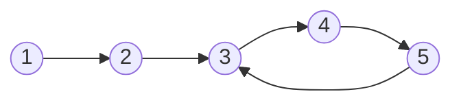
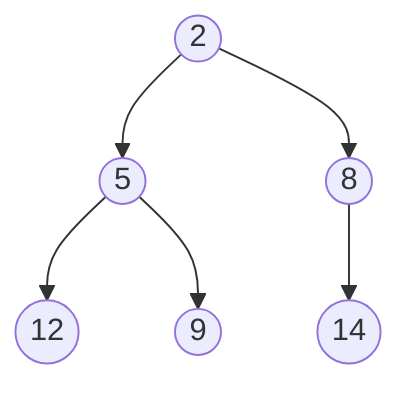
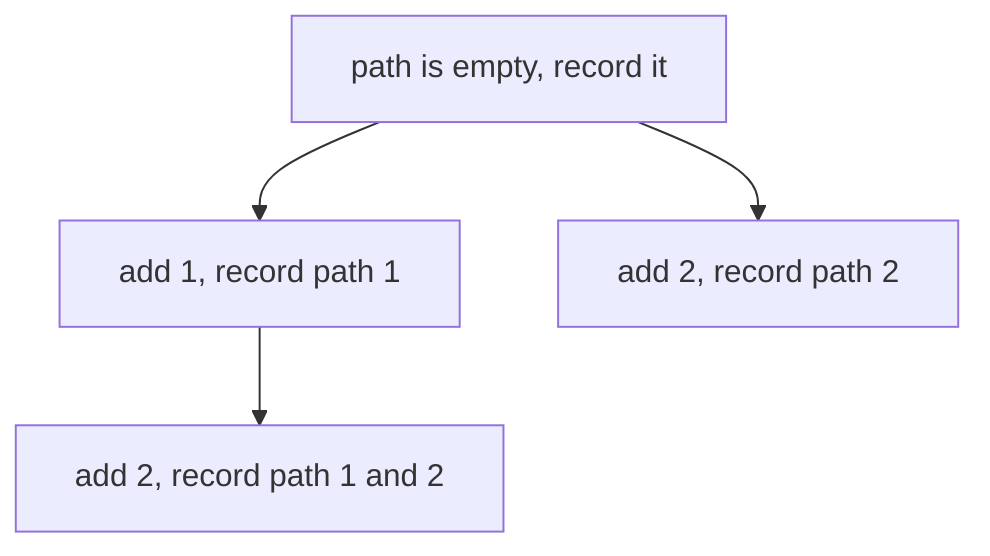
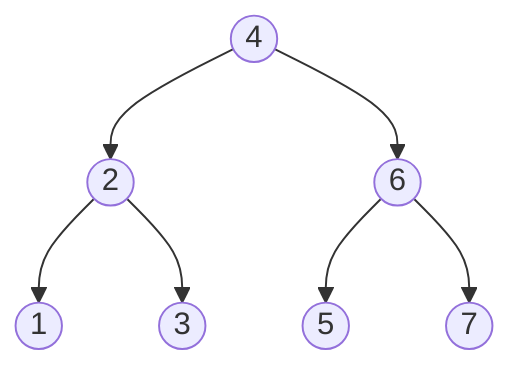
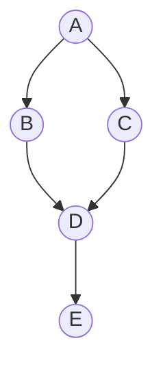

# 🧩 The Ultimate DSA Patterns Guide

> Master ~15 recurring patterns instead of memorizing 500+ isolated problems. If you can *name* the pattern a problem belongs to, you already know 80% of the solution.

## Why Patterns, Not Problems

There are thousands of problems on LeetCode and GeeksforGeeks, but almost all of them are built from the same ~15 underlying techniques. Once you deeply understand **Sliding Window**, for example, you don't need to have seen "Longest Substring Without Repeating Characters" before — you recognize the shape of the problem, reach for the template, and adapt it.

This guide is built around that idea. For every pattern you get:
- **Prerequisites** — what you should already be comfortable with before starting this one.
- **The Idea** — a plain-English explanation of what's actually happening, with an intuition or analogy.
- **A visual** — a small diagram or worked example so you can *see* the mechanic before you read any code.
- **When to spot it** — the phrases and clues in a problem statement that scream "use this pattern."
- **Complexity** — what time/space you should expect.
- **A working template** — real, runnable Python you can adapt (the logic ports directly to Java, C++, JS, or anything else).
- **A curated problem list** — Easy → Hard, so you can build the pattern up from first principles to its trickiest variants.

## How to Use This Guide

1. **Go in order.** The patterns are sequenced roughly by increasing difficulty and by dependency (e.g. Recursion before Backtracking before Trees before Graphs) — check each pattern's **Prerequisites** line if you want to jump around instead.
2. **Read the idea and look at the picture, then close the tab.** Don't jump straight to problems with the template open — understand *why* it works first.
3. **Solve the Easy problems cold**, no solutions open, timeboxed to ~25–30 minutes. This is where pattern-recognition is actually built.
4. **Stuck after 30 minutes?** Re-read the template, understand the piece you were missing, then re-attempt from scratch (don't just copy it in).
5. **Once Easy feels obvious, move to Medium/Hard.** These test whether you can *adapt* the pattern to twists, not just apply it verbatim.
6. **Revisit weekly.** Pick one random problem from an earlier pattern and re-solve it from memory. This spaced repetition is what makes the pattern permanent instead of something you forget in a month.

## Before You Start

You don't need much to begin:
- Comfort with one programming language (any language works — examples here are in Python for readability).
- A basic sense of what "time complexity" means — see the cheat sheet right below, it's all you need to start.
- A free [LeetCode](https://leetcode.com/) and [GeeksforGeeks](https://www.geeksforgeeks.org/) account to submit solutions.

### Big-O Cheat Sheet

| Complexity | Name | Feels Like | Roughly OK up to (n) |
|---|---|---|---|
| O(1) | Constant | direct lookup | any size |
| O(log n) | Logarithmic | binary search | 10^9+ |
| O(n) | Linear | one full pass | ~10^8 |
| O(n log n) | Linearithmic | sort + scan | ~10^6–10^7 |
| O(n²) | Quadratic | nested loops | ~10^4 |
| O(2ⁿ) | Exponential | try every subset | ~20–25 |
| O(n!) | Factorial | try every ordering | ~10–11 |

Use this as a sanity check: if a problem's constraints say `n ≤ 10^5`, an O(n²) solution will time out — you need O(n log n) or better. Checking constraints against this table *before* coding saves enormous amounts of wasted effort.

## Table of Contents

1. [Two Pointers](#1-two-pointers)
2. [Fast & Slow Pointers](#2-fast--slow-pointers)
3. [Sliding Window](#3-sliding-window)
4. [Kadane's Algorithm](#4-kadanes-algorithm)
5. [Prefix Sum](#5-prefix-sum)
6. [Merge Intervals](#6-merge-intervals)
7. [In-place Reversal of a LinkedList](#7-in-place-reversal-of-a-linkedlist)
8. [Stack](#8-stack)
9. [Hash Maps](#9-hash-maps)
10. [Binary Search](#10-binary-search)
11. [Heap Pattern](#11-heap-pattern)
12. [Recursion & Backtracking](#12-recursion--backtracking)
13. [Tree Pattern](#13-tree-pattern)
14. [Graphs](#14-graphs)
15. [Dynamic Programming](#15-dynamic-programming)
16. [Suggested Study Roadmap](#suggested-study-roadmap)

---

## 1. Two Pointers

**Prerequisites:** Arrays, basic loops.

**The Idea:** Use two indices that move through a structure — usually a sorted array or a string — instead of one, so you can scan it in a single pass rather than checking every pair. Picture two people starting at opposite ends of a sorted line of numbers and walking toward each other until they find what they're looking for: that's the whole trick.

```
Find a pair that sums to 9 in: [2, 7, 11, 15]

 [ 2    7    11    15 ]
   ↑                 ↑
   L                 R      2 + 15 = 17  (too big)  → move R left

 [ 2    7    11    15 ]
   ↑            ↑
   L            R           2 + 11 = 13  (too big)  → move R left

 [ 2    7    11    15 ]
   ↑     ↑
   L     R                  2 + 7  =  9  ✓ found — return [0, 1]
```

`left` and `right` close in from both ends until they land on the answer — no nested loop required.

**When to spot it:** *"sorted array"*, *"pair that sums to"*, *"in-place, O(1) extra space"*, *"triplet"*, *"is this a palindrome"*.

**Complexity:** O(n) time, O(1) extra space.

```python
def two_pointer_pair_sum(arr, target):
    """arr must be sorted. Returns indices of a pair summing to target."""
    left, right = 0, len(arr) - 1
    while left < right:
        current = arr[left] + arr[right]
        if current == target:
            return [left, right]
        elif current < target:
            left += 1   # need a bigger sum -> move left pointer up
        else:
            right -= 1  # need a smaller sum -> move right pointer down
    return [-1, -1]
```

**⚠️ Common pitfall:** this only works cleanly on **sorted** data — if the array isn't sorted, either sort it first (O(n log n)) or reach for a hash map instead (see [Hash Maps](#9-hash-maps)). For triplet problems (3Sum), fix one pointer with a loop and two-pointer the rest — that turns an O(n³) brute force into O(n²).

<details>
<summary>📋 Practice Problems</summary>

| Problem | Difficulty | Link |
|---|---|---|
| Pair with Target Sum | Easy | [LeetCode](https://leetcode.com/problems/two-sum-ii-input-array-is-sorted/description/) |
| Rearrange 0s and 1s | Easy | [GfG](https://www.geeksforgeeks.org/problems/segregate-0s-and-1s5106/1) |
| Remove Duplicates | Easy | [LeetCode I](https://leetcode.com/problems/remove-duplicates-from-sorted-list/) · [LeetCode II](https://leetcode.com/problems/remove-duplicates-from-sorted-array/description/) · [LeetCode III](https://leetcode.com/problems/remove-duplicates-from-sorted-array-ii/) |
| Squaring a Sorted Array | Easy | [LeetCode](https://leetcode.com/problems/squares-of-a-sorted-array/) |
| Triplet Sum to Zero | Medium | [LeetCode](https://leetcode.com/problems/3sum/) |
| Triplet Sum Close to Target | Medium | [LeetCode](https://leetcode.com/problems/3sum-closest/) |
| Triplets with Smaller Sum | Medium | [GfG](https://www.geeksforgeeks.org/problems/count-triplets-with-sum-smaller-than-x5549/1) |
| Subarrays with Product Less than a Target | Medium | [LeetCode](https://leetcode.com/problems/subarray-product-less-than-k/) |
| Dutch National Flag Problem | Medium | [LeetCode](https://leetcode.com/problems/sort-colors/description/) |
| **Challenge 1:** Quadruple Sum to Target | Medium | [LeetCode](https://leetcode.com/problems/4sum/) |
| **Challenge 2:** Comparing Strings with Backspaces | Medium | [LeetCode](https://leetcode.com/problems/backspace-string-compare/) |
| **Challenge 3:** Minimum Window Sort | Medium | [LeetCode](https://leetcode.com/problems/shortest-unsorted-continuous-subarray/) · [Reference](https://www.ideserve.co.in/learn/minimum-length-subarray-sorting-which-results-in-sorted-array) |

</details>

---

## 2. Fast & Slow Pointers

**Prerequisites:** Linked lists, [Two Pointers](#1-two-pointers).

**The Idea:** Also called Floyd's Cycle Detection or "the tortoise and the hare." Two pointers move through a sequence at different speeds — one step at a time vs. two steps at a time. If the sequence loops back on itself, the fast pointer will eventually lap the slow one, exactly like two runners on a circular track.



Nodes 3→4→5 loop back to 3. `slow` (1 step at a time) and `fast` (2 steps at a time) both enter the loop and are guaranteed to meet somewhere inside it — that's your cycle detected.

**When to spot it:** *"linked list"*, *"detect a cycle"*, *"find the middle"*, *"a number that keeps reappearing"* (Happy Number, Find the Duplicate Number — these treat array values as implicit "next pointers").

**Complexity:** O(n) time, O(1) space.

```python
def has_cycle(head):
    slow = fast = head
    while fast and fast.next:
        slow = slow.next
        fast = fast.next.next
        if slow == fast:
            return True
    return False
```

**⚠️ Common pitfall:** always check both `fast` and `fast.next` before advancing `fast` two steps, or you'll crash on a null pointer. To find *where* the cycle starts (not just whether one exists): once `slow` and `fast` meet, reset one pointer to `head` and advance both one step at a time — they meet again exactly at the cycle's start. It looks like magic the first time; it's just modular arithmetic on the cycle length.

<details>
<summary>📋 Practice Problems</summary>

| Problem | Difficulty | Link |
|---|---|---|
| LinkedList Cycle | Easy | [LeetCode](https://leetcode.com/problems/linked-list-cycle/) |
| Start of LinkedList Cycle | Medium | [LeetCode](https://leetcode.com/problems/linked-list-cycle-ii/) |
| Happy Number | Medium | [LeetCode](https://leetcode.com/problems/happy-number/) |
| Find Duplicate Number | Medium | [LeetCode](https://leetcode.com/problems/find-the-duplicate-number/description/) |
| Middle of the LinkedList | Easy | [LeetCode](https://leetcode.com/problems/middle-of-the-linked-list/) |
| **Challenge 1:** Palindrome LinkedList | Medium | [LeetCode](https://leetcode.com/problems/palindrome-linked-list/) |
| **Challenge 2:** Rearrange a LinkedList | Medium | [LeetCode](https://leetcode.com/problems/reorder-list/) |
| **Challenge 3:** Cycle in a Circular Array | Hard | [LeetCode](https://leetcode.com/problems/circular-array-loop/) |

</details>

---

## 3. Sliding Window

**Prerequisites:** Arrays, [Two Pointers](#1-two-pointers).

**The Idea:** When you need something about every contiguous subarray/substring of a certain kind, don't recompute it from scratch for every window — slide the window by one position and update your running answer incrementally. Think of looking through a train window: as the train moves, you don't re-examine the whole landscape, you just notice what left view on one side and what entered on the other.

```
arr = [2, 1, 5, 1, 3, 2],  k = 3

[2  1  5] 1  3  2      window sum = 8
 2 [1  5  1] 3  2      window sum = 7   (2 left the window, 1 entered)
 2  1 [5  1  3] 2      window sum = 9   (1 left the window, 3 entered)
 2  1  5 [1  3  2]     window sum = 6   (5 left the window, 2 entered)

                                          max window sum = 9
```

The window slides one step right each time — drop the value that fell off the left, add the value that entered on the right, no recomputation of the whole sum.

**When to spot it:** *"contiguous subarray"*, *"substring"*, *"window of size k"*, *"longest/shortest ... satisfying some condition"*.

**Complexity:** O(n) time, O(1) or O(k) space.

There are two flavors:
- **Fixed-size window** — the window size is given (e.g. "max sum of any subarray of size K").
- **Variable-size window** — the window grows and shrinks based on a condition (e.g. "smallest subarray with sum ≥ target").

```python
def smallest_subarray_with_sum(arr, target_sum):
    """Variable-size window: grow until valid, then shrink while still valid."""
    window_sum, min_len, start = 0, float('inf'), 0
    for end in range(len(arr)):
        window_sum += arr[end]
        while window_sum >= target_sum:
            min_len = min(min_len, end - start + 1)
            window_sum -= arr[start]
            start += 1
    return min_len if min_len != float('inf') else 0
```

**⚠️ Common pitfall:** mixing up the two flavors. If the problem gives you a fixed `k`, you only ever add the new element and remove the one that fell off — no inner `while` loop needed. If the window size depends on a condition, you need the inner shrink loop shown above.

<details>
<summary>📋 Practice Problems</summary>

| Problem | Difficulty | Link |
|---|---|---|
| Maximum Sum Subarray of Size K | Easy | [GfG](https://www.geeksforgeeks.org/problems/max-sum-subarray-of-size-k5313/1) |
| Smallest Subarray with a Given Sum | Easy | [LeetCode](https://leetcode.com/problems/minimum-size-subarray-sum/) |
| Longest Substring with K Distinct Characters | Medium | [GfG](https://www.geeksforgeeks.org/problems/longest-k-unique-characters-substring0853/1) |
| Fruits into Baskets | Medium | [LeetCode](https://leetcode.com/problems/fruit-into-baskets/) |
| No-repeat Substring | Hard | [LeetCode](https://leetcode.com/problems/longest-substring-without-repeating-characters/) |
| Longest Substring with Same Letters after Replacement | Hard | [LeetCode](https://leetcode.com/problems/longest-repeating-character-replacement/) |
| Longest Subarray with Ones after Replacement | Hard | [LeetCode](https://leetcode.com/problems/max-consecutive-ones-iii/) |
| Minimum Window Substring | Hard | [LeetCode](https://leetcode.com/problems/minimum-window-substring/description/?envType=study-plan-v2&envId=top-interview-150) |
| **Challenge 1:** Permutation in a String | Hard | [LeetCode](https://leetcode.com/problems/permutation-in-string/) |
| **Challenge 2:** String Anagrams | Hard | [LeetCode](https://leetcode.com/problems/find-all-anagrams-in-a-string/) |
| **Challenge 4:** Words Concatenation | Hard | [LeetCode](https://leetcode.com/problems/substring-with-concatenation-of-all-words/) |

</details>

---

## 4. Kadane's Algorithm

**Prerequisites:** Arrays, running sums.

**The Idea:** A tiny but powerful decision made at every index: *"should I extend the previous subarray, or cut my losses and start a fresh one from here?"* You're really doing one-step dynamic programming — the best subarray ending exactly at index `i` is either just `arr[i]` alone, or `arr[i]` tacked onto the best subarray ending at `i-1`, whichever is bigger.

```
arr[i]:              -2    1   -3    4   -1    2    1   -5    4
decision:            init  new  ext  new  ext  ext  ext  ext  ext
max_ending_here:      -2    1   -2    4    3    5    6    1    5
max_so_far:           -2    1    1    4    4    5    6    6    6
                                            └──────best run──────┘
                                     best subarray: [4, -1, 2, 1] = 6
```

`new` = start fresh from this element. `ext` = extend the previous run. Whenever extending would leave you worse off than the element alone, restart — that's the entire algorithm.

**When to spot it:** *"maximum subarray sum"*, *"maximum product subarray"*, *"best contiguous run"*.

**Complexity:** O(n) time, O(1) space.

```python
def max_subarray_sum(arr):
    max_ending_here = max_so_far = arr[0]
    for num in arr[1:]:
        max_ending_here = max(num, max_ending_here + num)
        max_so_far = max(max_so_far, max_ending_here)
    return max_so_far
```

**⚠️ Common pitfall:** for "maximum **product** subarray," a single negative number can turn a very negative running product into the new maximum once multiplied by another negative. Track both a running max **and** a running min at each step, and swap them when you hit a negative number.

<details>
<summary>📋 Practice Problems</summary>

| Problem | Link |
|---|---|
| Maximum Subarray Sum | [LeetCode](https://leetcode.com/problems/maximum-subarray/) |
| Minimum Subarray Sum | [GfG](https://www.geeksforgeeks.org/problems/smallest-sum-contiguous-subarray/1) |
| Maximum Product Subarray | [LeetCode](https://leetcode.com/problems/maximum-product-subarray/) |
| Maximum Subarray Sum with One Deletion | [LeetCode](https://leetcode.com/problems/maximum-subarray-sum-with-one-deletion/description/) |
| Maximum Absolute Sum of Any Subarray | [LeetCode](https://leetcode.com/problems/maximum-absolute-sum-of-any-subarray/) |
| Maximum Sum Circular Subarray | [LeetCode](https://leetcode.com/problems/maximum-sum-circular-subarray/) |

</details>

---

## 5. Prefix Sum

**Prerequisites:** Arrays; basic hash maps help for the counting variant (see [Hash Maps](#9-hash-maps)).

**The Idea:** Precompute a running total as you scan left to right, so that the sum of *any* range becomes a single subtraction instead of a fresh loop. If `prefix[i]` is the sum of everything before index `i`, then the sum of the range `[i, j]` is just `prefix[j+1] - prefix[i]`.

```
index:       0   1   2   3   4
arr:         3   1   4   1   5
prefix:   0  3   4   8   9  14      prefix[i] = sum of arr[0 .. i-1]

Sum of arr[1..3]  (1 + 4 + 1 = 6):
   = prefix[4] - prefix[1]
   = 9 - 3
   = 6   ✓
```

Any range sum becomes one subtraction once the prefix array is built — no re-summing the range every time it's asked about.

**When to spot it:** *"subarray sum equals K"*, *"range sum query"*, *"number of subarrays with property X"*, especially when it's repeated many times.

**Complexity:** O(n) to build, O(1) per range query.

```python
def subarray_sum_equals_k(arr, k):
    """Combine prefix sums with a hash map to count subarrays summing to k in O(n)."""
    count, prefix_sum = 0, 0
    seen = {0: 1}  # prefix_sum value -> how many times we've seen it
    for num in arr:
        prefix_sum += num
        count += seen.get(prefix_sum - k, 0)
        seen[prefix_sum] = seen.get(prefix_sum, 0) + 1
    return count
```

**⚠️ Common pitfall:** forgetting to seed the hash map with `{0: 1}` — that accounts for a subarray starting at index 0 itself summing to exactly `k`. This "prefix sum + hash map" combo is one of the highest-leverage tricks in this whole list: it shows up disguised in dozens of "count subarrays with property X" problems.

<details>
<summary>📋 Practice Problems</summary>

| Problem | Difficulty | Link |
|---|---|---|
| Subarray Sum Equals K | Easy | [LeetCode](https://leetcode.com/problems/subarray-sum-equals-k/description/) |
| Find Pivot Index | Easy | [LeetCode](https://leetcode.com/problems/find-pivot-index/description/) |
| Subarray Sums Divisible By K | Medium | [LeetCode](https://leetcode.com/problems/subarray-sums-divisible-by-k/description/) |
| Contiguous Array | Medium | [LeetCode](https://leetcode.com/problems/contiguous-array/description/) |
| **Challenge:** Shortest Subarray With Sum at Least K | Hard | [LeetCode](https://leetcode.com/problems/shortest-subarray-with-sum-at-least-k/description/) |
| **Challenge:** Count Range Sum | Hard | [LeetCode](https://leetcode.com/problems/count-of-range-sum/description/) |

</details>

---

## 6. Merge Intervals

**Prerequisites:** Sorting, arrays.

**The Idea:** Sort intervals by their start time, then walk through once: if the next interval overlaps the one you're currently holding, merge them; otherwise, close out the current one and start holding the next. This is essentially "greedy + sort."

```
Intervals: [1,3]  [2,6]  [8,10]  [15,18]

 1  2  3  4  5  6  7  8  9  10 ...      15 16 17 18
 [--1,3--]
    [-----2,6-----]
                      [--8,10--]
                                          [---15,18---]

 [1,3] and [2,6] overlap (3 ≥ 2)          → merge into [1,6]
 [8,10] and [15,18] touch nothing else    → stay as they are

 Result: [1,6]  [8,10]  [15,18]
```

Sorted by start time, overlapping neighbors collapse into one interval in a single left-to-right pass — no need to compare every pair.

**When to spot it:** *"intervals"*, *"meetings"*, *"overlapping ranges"*, *"merge/insert a range"*, calendar-style scheduling.

**Complexity:** O(n log n) for the sort, O(n) for the merge pass.

```python
def merge_intervals(intervals):
    intervals.sort(key=lambda pair: pair[0])
    merged = [intervals[0]]
    for start, end in intervals[1:]:
        if start <= merged[-1][1]:          # overlaps the last kept interval
            merged[-1][1] = max(merged[-1][1], end)
        else:
            merged.append([start, end])
    return merged
```

**⚠️ Common pitfall:** forgetting to sort first — the whole "single pass" trick depends on intervals arriving in start-time order. "Minimum Meeting Rooms" is this exact pattern plus a min-heap that tracks currently-occupied rooms by end time.

<details>
<summary>📋 Practice Problems</summary>

| Problem | Difficulty | Link |
|---|---|---|
| Merge Intervals | Medium | [LeetCode](https://leetcode.com/problems/merge-intervals/description/) |
| Insert Interval | Medium | [LeetCode](https://leetcode.com/problems/insert-interval/) |
| Intervals Intersection | Medium | [LeetCode](https://leetcode.com/problems/interval-list-intersections/description/) |
| Overlapping Intervals | — | [GfG](https://www.geeksforgeeks.org/check-if-any-two-intervals-overlap-among-a-given-set-of-intervals/) |
| **Challenge 1:** Minimum Meeting Rooms | Hard | [GfG](https://www.geeksforgeeks.org/problems/attend-all-meetings-ii/1) |
| **Challenge 2:** Maximum CPU Load | Hard | [GfG](https://www.geeksforgeeks.org/maximum-cpu-load-from-the-given-list-of-jobs/) |
| **Challenge 3:** Employee Free Time | Hard | [CoderTrain](https://www.codertrain.co/employee-free-time) |

</details>

---

## 7. In-place Reversal of a LinkedList

**Prerequisites:** Linked lists, pointer manipulation.

**The Idea:** Reverse the direction of the `next` pointers one at a time, without allocating a new list. You need exactly three pointers in motion: `prev` (what you've already reversed), `curr` (the node you're flipping right now), and a temporary `next_node` (so you don't lose the rest of the list once you overwrite `curr.next`).

```
Before:  1 → 2 → 3 → 4 → None

 None        curr=1 → 2 → 3 → 4 → None     prev=None
 None ← 1    curr=2 → 3 → 4 → None         prev=1
 None ← 1 ← 2    curr=3 → 4 → None         prev=2
 None ← 1 ← 2 ← 3    curr=4 → None         prev=3
 None ← 1 ← 2 ← 3 ← 4                      prev=4, curr=None → done

After:   4 → 3 → 2 → 1 → None
```

Each node's arrow is flipped one at a time; `prev` marches forward and becomes the new head once `curr` runs out.

**When to spot it:** *"reverse a linked list"*, *"in groups of k"*, *"without using extra space"*.

**Complexity:** O(n) time, O(1) space.

```python
def reverse_linked_list(head):
    prev = None
    curr = head
    while curr:
        next_node = curr.next   # save what comes next before we overwrite it
        curr.next = prev        # flip the pointer
        prev = curr
        curr = next_node
    return prev  # prev is now the new head
```

**⚠️ Common pitfall:** overwriting `curr.next` before saving it — always save `next_node` first. For "reverse in groups of K," apply this exact template to each K-sized chunk, then carefully stitch the reversed chunks back together; getting the "connect the pieces" part right is the only genuinely new difficulty.

<details>
<summary>📋 Practice Problems</summary>

| Problem | Difficulty | Link |
|---|---|---|
| Reverse a LinkedList | Easy | [LeetCode](https://leetcode.com/problems/reverse-linked-list/) |
| Reverse a Sub-list | Medium | [LeetCode](https://leetcode.com/problems/reverse-linked-list-ii/) |
| Reverse List in Pairs | Medium | [LeetCode](https://leetcode.com/problems/swap-nodes-in-pairs/description/) |
| Reverse Every K-element Sub-list | Hard | [LeetCode](https://leetcode.com/problems/reverse-nodes-in-k-group/) |
| **Challenge 1:** Reverse Nodes in Even Length Groups | Hard | [LeetCode](https://leetcode.com/problems/reverse-nodes-in-even-length-groups/description/) |
| **Challenge 2:** Rotate a LinkedList | Medium | [LeetCode](https://leetcode.com/problems/rotate-list/) |

</details>

---

## 8. Stack

**Prerequisites:** Arrays or linked lists (whichever you implement it with).

**The Idea:** A stack is Last-In-First-Out — perfect whenever a problem needs you to remember "the most recent unresolved thing" and resolve it before anything older. Matching brackets, undo history, and finding the "next greater element" all boil down to this same idea: push things you haven't resolved yet, and pop them the moment you find their match.

```
push(1)     push(2)     push(3)      pop() → 3
 ┌───┐       ┌───┐        ┌───┐        ┌───┐
 │   │       │   │        │ 3 │        │   │
 │   │  -->  │ 2 │  -->   │ 2 │  -->   │ 2 │
 │ 1 │       │ 1 │        │ 1 │        │ 1 │
 └───┘       └───┘        └───┘        └───┘
                                     top of stack
```

Last in, first out — whatever was pushed most recently is the first thing popped. This exact mechanism is what the monotonic stack below relies on: push candidates, pop them the moment a bigger number resolves them.

**When to spot it:** *"valid parentheses"*, *"next greater/smaller element"*, *"daily temperatures"*, *"simplify a path"*, anything about matching or undoing.

**Complexity:** O(n) time, O(n) space.

```python
def next_greater_element(arr):
    """Monotonic stack: keep indices of numbers waiting for a bigger number to their right."""
    result = [-1] * len(arr)
    stack = []  # stores indices; values at those indices are kept decreasing
    for i, num in enumerate(arr):
        while stack and arr[stack[-1]] < num:
            result[stack.pop()] = num
        stack.append(i)
    return result
```

**⚠️ Common pitfall:** whenever you see "next greater" or "next smaller," think **monotonic stack** immediately — a stack that's kept strictly increasing or decreasing so each element is pushed and popped at most once, giving you an O(n) solution instead of the O(n²) brute force of checking every pair.

<details>
<summary>📋 Practice Problems</summary>

| Problem | Difficulty | Link |
|---|---|---|
| Remove Adjacent Duplicates | — | [LeetCode](https://leetcode.com/problems/remove-all-adjacent-duplicates-in-string/description/) |
| Balanced Parentheses | — | [LeetCode](https://leetcode.com/problems/valid-parentheses/description/) |
| Next Greater Element | Easy | [LeetCode](https://leetcode.com/problems/next-greater-element-ii/description/) |
| Daily Temperatures | Easy | [LeetCode](https://leetcode.com/problems/daily-temperatures/) |
| Remove Nodes From Linked List | Easy | [LeetCode](https://leetcode.com/problems/remove-nodes-from-linked-list/) |
| Remove All Adjacent Duplicates in String II | Medium | [LeetCode](https://leetcode.com/problems/remove-all-adjacent-duplicates-in-string-ii/) |
| Simplify Path | Challenge | [LeetCode](https://leetcode.com/problems/simplify-path/) |
| Remove K Digits | Hard / Challenge | [LeetCode](https://leetcode.com/problems/remove-k-digits/) |

</details>

---

## 9. Hash Maps

**Prerequisites:** Arrays; basic hashing/dictionary concept.

**The Idea:** This is less a "pattern" and more a reflex you should build: any time you catch yourself about to write a nested loop just to answer *"have I seen this before?"* or *"how many times does this appear?"*, a hash map answers that in O(1) instead of O(n), turning an O(n²) brute force into O(n).

```
counts = {}
for ch in "leetcode":
    counts[ch] = counts.get(ch, 0) + 1

  'l' -> 1        each lookup is O(1),
  'e' -> 3        no matter how long
  't' -> 1        the string is
  'c' -> 1
  'o' -> 1
  'd' -> 1
```

Each key maps straight to its value — no scanning required to answer "have I seen this before?"

**When to spot it:** *"first non-repeating"*, *"count of"*, *"anagram"*, *"have you seen this value before"*.

**Complexity:** O(n) time, O(n) space.

```python
def first_unique_char(s):
    counts = {}
    for ch in s:
        counts[ch] = counts.get(ch, 0) + 1
    for i, ch in enumerate(s):
        if counts[ch] == 1:
            return i
    return -1
```

**⚠️ Common pitfall:** reaching for a hash map is easy once you know to look for it — the actual skill is *noticing* the opportunity. Before writing any nested loop, pause and ask: "could a hash map remember this for me instead?"

<details>
<summary>📋 Practice Problems</summary>

| Problem | Difficulty | Link |
|---|---|---|
| First Non-repeating Character | Easy | [LeetCode](https://leetcode.com/problems/first-unique-character-in-a-string/) |
| Maximum Number of Balloons | Easy | [LeetCode](https://leetcode.com/problems/maximum-number-of-balloons/) |
| Longest Palindrome | Easy | [LeetCode](https://leetcode.com/problems/longest-palindrome/) |
| Ransom Note | Easy | [LeetCode](https://leetcode.com/problems/ransom-note/) |

</details>

---

## 10. Binary Search

**Prerequisites:** Sorted arrays.

**The Idea:** Repeatedly cut a sorted search space in half by comparing the middle element to your target, and throw away the half that can't possibly contain the answer. The less obvious but *extremely* powerful extension is **binary search on the answer**: instead of searching array indices, you binary search over the space of possible answers (e.g. "what's the smallest capacity that works?") and use a greedy feasibility check to decide which half to keep.

```
Find 23 in: [2, 5, 8, 12, 16, 23, 38, 56, 72, 91]
index:        0  1  2   3   4   5   6   7   8   9

Step 1: left=0 right=9 mid=4 -> arr[mid]=16 < 23  -> search right (left=5)
Step 2: left=5 right=9 mid=7 -> arr[mid]=56 > 23  -> search left  (right=6)
Step 3: left=5 right=6 mid=5 -> arr[mid]=23 == 23 -> found at index 5 ✓
```

Each step throws away half the remaining space — that's how you get from n elements down to 1 in just log n steps.

**When to spot it:** *"sorted array"*, *"rotated sorted array"*, *"Kth smallest/largest"* — but also *"minimize the maximum"* or *"find the minimum X such that Y is possible"*, which is your cue for binary-search-on-the-answer even when no array is explicitly "sorted."

**Complexity:** O(log n) time.

```python
def binary_search(arr, target):
    left, right = 0, len(arr) - 1
    while left <= right:
        mid = left + (right - left) // 2   # avoids overflow in other languages
        if arr[mid] == target:
            return mid
        elif arr[mid] < target:
            left = mid + 1
        else:
            right = mid - 1
    return -1
```

```python
def min_capacity_to_ship(weights, days):
    """Binary search on the answer: search over possible capacities, not array indices."""
    def can_ship_within(capacity):
        days_needed, current_load = 1, 0
        for w in weights:
            if current_load + w > capacity:
                days_needed += 1
                current_load = 0
            current_load += w
        return days_needed <= days

    lo, hi = max(weights), sum(weights)
    while lo < hi:
        mid = (lo + hi) // 2
        if can_ship_within(mid):
            hi = mid       # mid works — maybe something smaller also works
        else:
            lo = mid + 1   # mid doesn't work — need more capacity
    return lo
```

**⚠️ Common pitfall:** getting the loop bounds and midpoint update wrong is the #1 source of infinite loops in binary search. Decide up front whether your bounds are inclusive (`left <= right`) or exclusive (`left < right`) and stay consistent — mixing conventions mid-function is where most bugs come from.

<details>
<summary>📋 Practice Problems</summary>

| Problem | Link |
|---|---|
| Binary Search (basic) | [LeetCode](https://leetcode.com/problems/binary-search/) |
| Upper Bound / Ceiling | [GfG](https://www.geeksforgeeks.org/problems/ceil-in-a-sorted-array/1) |
| First and Last Position | [LeetCode](https://leetcode.com/problems/find-first-and-last-position-of-element-in-sorted-array/) |
| Count Number of Occurrences | [GfG](https://www.geeksforgeeks.org/problems/number-of-occurrence2259/1) |
| Search in Infinite Sorted Array | [GfG](https://www.geeksforgeeks.org/find-position-element-sorted-array-infinite-numbers/) |
| Peak Index in Mountain Array | [LeetCode](https://leetcode.com/problems/peak-index-in-a-mountain-array/) |
| Find Peak Element | [LeetCode](https://leetcode.com/problems/find-peak-element/) |
| Find Minimum in Rotated Sorted Array | [LeetCode](https://leetcode.com/problems/find-minimum-in-rotated-sorted-array/) |
| Number of Rotations in Sorted Array | [GfG](https://www.geeksforgeeks.org/problems/rotation4723/1) |
| Search in Rotated Sorted Array | [LeetCode](https://leetcode.com/problems/search-in-rotated-sorted-array/description/) |
| Koko Eating Bananas | [LeetCode](https://leetcode.com/problems/koko-eating-bananas/) |
| Min Days to Make M Bouquets | [LeetCode](https://leetcode.com/problems/minimum-number-of-days-to-make-m-bouquets/) |
| Aggressive Cows | [GfG](https://www.geeksforgeeks.org/problems/aggressive-cows/1) |
| H-Index II | [LeetCode](https://leetcode.com/problems/h-index-ii/description/) |
| Max Candies Allocated to K Children | [LeetCode](https://leetcode.com/problems/maximum-candies-allocated-to-k-children/description/) |
| Capacity to Ship Packages within D Days | [LeetCode](https://leetcode.com/problems/capacity-to-ship-packages-within-d-days/description/) |
| Book Allocation Problem | [GfG](https://www.geeksforgeeks.org/problems/allocate-minimum-number-of-pages0937/1) |
| Split Array Largest Sum | [LeetCode](https://leetcode.com/problems/split-array-largest-sum/description/) |
| Search a 2D Matrix | [LeetCode](https://leetcode.com/problems/search-a-2d-matrix/) |
| Search a 2D Matrix II (Hard) | [LeetCode](https://leetcode.com/problems/search-a-2d-matrix-ii/description/) |
| Kth Smallest in Sorted Matrix | [LeetCode](https://leetcode.com/problems/kth-smallest-element-in-a-sorted-matrix/description/) |
| Kth Smallest in Multiplication Table | [LeetCode](https://leetcode.com/problems/kth-smallest-number-in-multiplication-table/description/) |
| Median of Two Sorted Arrays | [LeetCode](https://leetcode.com/problems/median-of-two-sorted-arrays/) |

</details>

---

## 11. Heap Pattern

**Prerequisites:** Binary trees (basic), arrays; [Binary Search](#10-binary-search) intuition helps.

**The Idea:** A heap keeps the smallest (min-heap) or largest (max-heap) element accessible instantly, with O(log n) insert/remove. That makes it the natural tool anywhere you keep needing "the current biggest/smallest thing" repeatedly. Four sub-patterns cover almost everything:

- **Top-K** — maintain a heap of size K; anything worse than the heap's root gets ignored.
- **K-way merge** — push the head of each of K sorted lists into a min-heap; repeatedly pop the smallest and push its successor.
- **Two heaps** — a max-heap for the smaller half of your data + a min-heap for the larger half, kept balanced, so the median is always O(1) to read (streaming median).
- **Greedy + heap** — a greedy algorithm that always needs "the current largest/smallest remaining item" at each step (Task Scheduler, Last Stone Weight).



This is a valid min-heap: every parent is ≤ its children, so the root (2) is always the minimum. The root is the *only* guarantee a heap gives you — and it's all these patterns actually need.

**When to spot it:** *"Kth largest/smallest"*, *"top K frequent"*, *"K closest"*, *"merge K sorted..."*, *"median of a stream"*.

**Complexity:** O(n log k) typically.

```python
import heapq

def kth_largest(nums, k):
    """Keep a min-heap of size k; its root is always the kth largest seen so far."""
    heap = []
    for num in nums:
        heapq.heappush(heap, num)
        if len(heap) > k:
            heapq.heappop(heap)
    return heap[0]
```

```python
import heapq

class MedianFinder:
    """Two heaps: 'small' (max-heap, values negated) holds the lower half,
    'large' (min-heap) holds the upper half, kept within 1 of each other in size."""
    def __init__(self):
        self.small = []
        self.large = []

    def add_num(self, num):
        heapq.heappush(self.small, -num)
        heapq.heappush(self.large, -heapq.heappop(self.small))
        if len(self.large) > len(self.small):
            heapq.heappush(self.small, -heapq.heappop(self.large))

    def find_median(self):
        if len(self.small) > len(self.large):
            return -self.small[0]
        return (-self.small[0] + self.large[0]) / 2
```

**⚠️ Common pitfall:** Python's `heapq` only implements a min-heap — for a max-heap, push negated values and negate again on the way out (that's what `MedianFinder` above is doing with `-num`).

<details>
<summary>📋 Practice Problems</summary>

| Problem | Link |
|---|---|
| Kth Smallest Element | [GfG](https://www.geeksforgeeks.org/problems/kth-smallest-element5635/1) |
| Kth Largest Element in an Array | [LeetCode](https://leetcode.com/problems/kth-largest-element-in-an-array/description/) |
| Top K Frequent Elements | [LeetCode](https://leetcode.com/problems/top-k-frequent-elements/description/) |
| Top K Frequent Words | [LeetCode](https://leetcode.com/problems/top-k-frequent-words/description/) |
| K Closest Points to Origin | [LeetCode](https://leetcode.com/problems/k-closest-points-to-origin/description/) |
| Find K Closest Elements | [LeetCode](https://leetcode.com/problems/find-k-closest-elements/description/) |
| Kth Weakest Row in a Matrix | [LeetCode](https://leetcode.com/problems/the-k-weakest-rows-in-a-matrix/description/) |
| **Heap as Pointer** — Merge K Sorted Arrays | [GfG](https://www.geeksforgeeks.org/problems/merge-k-sorted-arrays/1) |
| Kth Smallest in Sorted Matrix | [LeetCode](https://leetcode.com/problems/kth-smallest-element-in-a-sorted-matrix/description/) |
| **Greedy + Heap** — Last Stone Weight | [LeetCode](https://leetcode.com/problems/last-stone-weight/description/) |
| CPU Task Scheduler | [LeetCode](https://leetcode.com/problems/task-scheduler/description/) |
| Reorganize String | [LeetCode](https://leetcode.com/problems/reorganize-string/) |
| Minimum Number of Refueling Stops | [LeetCode](https://leetcode.com/problems/minimum-number-of-refueling-stops/description/) |
| IPO | [LeetCode](https://leetcode.com/problems/ipo/description/) |
| Course Schedule III | [LeetCode](https://leetcode.com/problems/course-schedule-iii/description/) |
| **Two Heaps** — Find Median from Data Stream | [LeetCode](https://leetcode.com/problems/find-median-from-data-stream/description/) |
| Sliding Window Median (Hard) | [LeetCode](https://leetcode.com/problems/sliding-window-median/description/) |

</details>

---

## 12. Recursion & Backtracking

**Prerequisites:** Comfort with functions calling themselves (the call stack).

**The Idea:** Recursion solves a problem by solving smaller copies of the same problem. Backtracking adds one more idea on top: *try a choice, recurse into it, and if it doesn't pan out, undo the choice and try the next one.* This "choose → explore → un-choose" loop is how you systematically generate every permutation, combination, or subset without missing any or repeating any.



Every node in this tree is a valid subset — the recursion explores the whole space one choice at a time, and `subsets([1, 2])` returns all four: `{}`, `{1}`, `{2}`, `{1, 2}`.

**When to spot it:** *"generate all"*, *"all possible combinations/permutations"*, *"partition"*, constraint-satisfaction puzzles (Sudoku, N-Queens).

**Complexity:** Often exponential (O(2ⁿ), O(n!)) since you're exploring a full solution space — the goal of backtracking is to *prune* branches early so it's fast in practice, not to change the worst case.

```python
def subsets(nums):
    """Backtracking = choose -> explore -> un-choose. Every recursive call
    records the current path as one valid subset before trying to extend it."""
    result = []
    path = []

    def backtrack(start):
        result.append(path[:])            # record the current subset
        for i in range(start, len(nums)):
            path.append(nums[i])           # choose
            backtrack(i + 1)               # explore
            path.pop()                     # un-choose

    backtrack(0)
    return result
```

**⚠️ Common pitfall:** forgetting the "un-choose" step (`path.pop()`) — without it, choices from one branch leak into sibling branches. Before writing any backtracking code, sketch the recursion tree on paper (like the diagram above); the base case and the pruning condition both become obvious once you can see the shape of the search.

<details>
<summary>📋 Practice Problems</summary>

| Problem | Link | Video |
|---|---|---|
| Fibonacci | [LeetCode](https://leetcode.com/problems/fibonacci-number/description/) | [YT](https://www.youtube.com/watch?v=j4wjZqzhMqc&t) |
| Check if String is Palindrome | [GfG](https://www.geeksforgeeks.org/problems/palindrome-string0817/1) | [YT](https://www.youtube.com/watch?v=j4wjZqzhMqc&t) |
| Check if Array is Sorted | [GfG](https://www.geeksforgeeks.org/problems/check-if-an-array-is-sorted0701/1) | [YT](https://www.youtube.com/watch?v=-gC-QEdpvO4) |
| Sum of Digits of a Number | [GfG](https://www.geeksforgeeks.org/problems/sum-of-digits1742/1) | [YT](https://www.youtube.com/watch?v=-gC-QEdpvO4) |
| Remove Occurrences of a Character in String | [GfG](https://www.geeksforgeeks.org/problems/remove-all-occurrences-of-a-character-in-a-string/1) | [YT](https://www.youtube.com/watch?v=-gC-QEdpvO4) |
| Generate Parentheses | [LeetCode](https://leetcode.com/problems/generate-parentheses/description/) | — |
| Letter Combinations of Phone Number | [LeetCode](https://leetcode.com/problems/letter-combinations-of-a-phone-number/description/) | [YT](https://www.youtube.com/watch?v=IKfIT6uFOcs) |
| Permutations | [LeetCode](https://leetcode.com/problems/permutations/description/) | — |
| Combination Sum | [LeetCode](https://leetcode.com/problems/combination-sum/description/) | — |
| Palindrome Partitioning | [LeetCode](https://leetcode.com/problems/palindrome-partitioning/description/) | — |

</details>

---

## 13. Tree Pattern

**Prerequisites:** [Recursion & Backtracking](#12-recursion--backtracking), queues (for BFS).

**The Idea:** Almost every tree problem is one of two traversal styles: **DFS** (go deep first — recursive, natural for anything about *paths* or *depth*) or **BFS** (go wide first — iterative with a queue, natural for anything about *levels*). Pick based on what the question is actually asking about.



**DFS (inorder: Left, Root, Right)** visits: 1, 2, 3, 4, 5, 6, 7 — sorted order, because this happens to be a valid BST.
**BFS (level order)** visits: 4, 2, 6, 1, 3, 5, 7 — one full row at a time.

**When to spot it:** any problem on a `TreeNode` structure — but *which* sub-pattern depends on the phrasing:
- *"traverse", "print in order"* → Traversal
- *"mirror", "symmetric", "same tree"* → Mirror & Symmetry
- *"lowest common ancestor", "search"* → Search / LCA
- *"balanced", "valid BST", "complete"* → Validation
- *"root-to-leaf", "path sum"* → Path Sum
- *"build/construct a tree from..."* → Construction

**Complexity:** O(n) time for most traversal-based problems; O(h) recursion-stack space, where h is the tree's height.

```python
# DFS (recursive) — inorder traversal
def inorder(root):
    result = []

    def dfs(node):
        if not node:
            return
        dfs(node.left)
        result.append(node.val)
        dfs(node.right)

    dfs(root)
    return result
```

```python
from collections import deque

# BFS (iterative) — level order traversal
def level_order(root):
    if not root:
        return []
    result, queue = [], deque([root])
    while queue:
        level = []
        for _ in range(len(queue)):
            node = queue.popleft()
            level.append(node.val)
            if node.left:
                queue.append(node.left)
            if node.right:
                queue.append(node.right)
        result.append(level)
    return result
```

**⚠️ Common pitfall:** treating a Binary **Search** Tree like a regular binary tree — its ordering property (left < node < right) lets you prune half the tree at every step, turning an O(n) search into O(log n) (see "Search in a BST" and "Kth Smallest in BST"). Don't do a full traversal when the BST property already tells you which side to look on.

<details>
<summary>📋 Practice Problems</summary>

**Traversal**

| Problem | Link |
|---|---|
| Inorder Traversal | [LeetCode](https://leetcode.com/problems/binary-tree-inorder-traversal/description/) |
| Preorder Traversal | [LeetCode](https://leetcode.com/problems/binary-tree-preorder-traversal/description/) |
| Postorder Traversal | [LeetCode](https://leetcode.com/problems/binary-tree-postorder-traversal/description/) |
| Level Order *(homework)* | [LeetCode](https://leetcode.com/problems/binary-tree-level-order-traversal/description/) |
| ZigZag Level Order | [LeetCode](https://leetcode.com/problems/binary-tree-zigzag-level-order-traversal/description/) |
| Level Order II | [LeetCode](https://leetcode.com/problems/binary-tree-level-order-traversal-ii/description/) |

**Mirror & Symmetry** *(homework)*

| Problem | Link |
|---|---|
| Invert Tree | [LeetCode](https://leetcode.com/problems/invert-binary-tree/description/) |
| Symmetric Tree | [LeetCode](https://leetcode.com/problems/symmetric-tree/description/) |
| Same Tree | [LeetCode](https://leetcode.com/problems/same-tree/description/) |
| Subtree of Another Tree | [LeetCode](https://leetcode.com/problems/subtree-of-another-tree/description/) |
| Flip Equivalent Tree | [LeetCode](https://leetcode.com/problems/flip-equivalent-binary-trees/description/) |

**Search**

| Problem | Link |
|---|---|
| LCA of Binary Tree | [LeetCode](https://leetcode.com/problems/lowest-common-ancestor-of-a-binary-tree/description/) |
| Search in a Binary Search Tree | [LeetCode](https://leetcode.com/problems/search-in-a-binary-search-tree/) |
| LCA of BST | [LeetCode](https://leetcode.com/problems/lowest-common-ancestor-of-a-binary-search-tree/description/) |
| LCA of Deepest Leaves | [LeetCode](https://leetcode.com/problems/lowest-common-ancestor-of-deepest-leaves/description/) |
| Two Sum IV — Input is a BST | [LeetCode](https://leetcode.com/problems/two-sum-iv-input-is-a-bst/description/) |
| Kth Smallest Element in BST | [LeetCode](https://leetcode.com/problems/kth-smallest-element-in-a-bst/description/) |

**Validation**

| Problem | Link |
|---|---|
| Minimum Depth of Binary Tree | [LeetCode](https://leetcode.com/problems/minimum-depth-of-binary-tree/description/) |
| Maximum Depth of Binary Tree | [LeetCode](https://leetcode.com/problems/maximum-depth-of-binary-tree/description/) |
| Balanced Binary Tree | [LeetCode](https://leetcode.com/problems/balanced-binary-tree/description/) |
| Diameter of Binary Tree | [LeetCode](https://leetcode.com/problems/diameter-of-binary-tree/description/) |
| Check Completeness of Binary Tree | [LeetCode](https://leetcode.com/problems/check-completeness-of-a-binary-tree/description/) |
| Validate BST | [LeetCode](https://leetcode.com/problems/validate-binary-search-tree/description/) |
| Recover BST | [LeetCode](https://leetcode.com/problems/recover-binary-search-tree/description/) |

**Path Sum**

| Problem | Link |
|---|---|
| Path Sum | [LeetCode](https://leetcode.com/problems/path-sum/description/) |
| Path Sum II | [LeetCode](https://leetcode.com/problems/path-sum-ii/) |
| Sum of Root to Leaf Numbers | [LeetCode](https://leetcode.com/problems/sum-root-to-leaf-numbers/description/) |
| Binary Tree Maximum Path Sum | [LeetCode](https://leetcode.com/problems/binary-tree-maximum-path-sum/description/) |

**Construction**

| Problem | Link |
|---|---|
| Construct Tree from Preorder + Inorder | [LeetCode](https://leetcode.com/problems/construct-binary-tree-from-preorder-and-inorder-traversal/description/) |
| Construct Tree from Postorder + Inorder | [LeetCode](https://leetcode.com/problems/construct-binary-tree-from-inorder-and-postorder-traversal/description/) |
| Sorted Array to BST | [LeetCode](https://leetcode.com/problems/convert-sorted-array-to-binary-search-tree/description/) |

</details>

---

## 14. Graphs

**Prerequisites:** [Tree Pattern](#13-tree-pattern) (DFS/BFS), queues and stacks.

**The Idea:** Graphs generalize trees — a node can have multiple parents, and cycles are allowed. Nearly every graph problem reduces to one of four questions: *"can I reach X from Y?"* (traversal), *"does this graph have a certain structure?"* (cycle/bipartite detection), *"in what order must these happen?"* (topological sort), or *"what's the cheapest way from A to B?"* (shortest path).



BFS from A fans out in layers: **A** → **B, C** → **D** → **E** — everything at distance 1 first, then distance 2, and so on. DFS from A instead commits to one path at a time: A → B → D → E, then backtracks to explore C.

**When to spot it:** grids, networks, dependency lists, *"islands"*, *"provinces"*, *"shortest/cheapest path"*, *"can these be scheduled"*.

**Complexity:** O(V + E) for traversal; O((V + E) log V) for Dijkstra with a heap.

- **DFS/BFS traversal** — connectivity, flood fill, counting islands.
- **Cycle detection** — track visited + recursion-stack (directed graphs) or track parents (undirected graphs).
- **Topological sort** — ordering under dependency constraints (Kahn's algorithm, or DFS + a stack).
- **Shortest path** — plain BFS if unweighted; **Dijkstra** if weighted with non-negative edges; **Bellman-Ford** if negative edges are allowed.
- **Minimum Spanning Tree** — Prim's or Kruskal's algorithm.

```python
from collections import deque

def num_islands(grid):
    """BFS flood-fill: count connected groups of '1's in a grid."""
    if not grid:
        return 0
    rows, cols = len(grid), len(grid[0])
    visited = set()
    islands = 0

    def bfs(r, c):
        queue = deque([(r, c)])
        visited.add((r, c))
        while queue:
            row, col = queue.popleft()
            for dr, dc in [(-1, 0), (1, 0), (0, -1), (0, 1)]:
                nr, nc = row + dr, col + dc
                if (0 <= nr < rows and 0 <= nc < cols
                        and (nr, nc) not in visited and grid[nr][nc] == '1'):
                    visited.add((nr, nc))
                    queue.append((nr, nc))

    for r in range(rows):
        for c in range(cols):
            if grid[r][c] == '1' and (r, c) not in visited:
                visited.add((r, c))
                bfs(r, c)
                islands += 1
    return islands
```

```python
import heapq

def dijkstra(graph, start):
    """graph: {node: [(neighbor, weight), ...]}. Returns shortest distance to every node."""
    distances = {node: float('inf') for node in graph}
    distances[start] = 0
    heap = [(0, start)]
    while heap:
        dist, node = heapq.heappop(heap)
        if dist > distances[node]:
            continue  # a shorter route to `node` was already found
        for neighbor, weight in graph[node]:
            new_dist = dist + weight
            if new_dist < distances[neighbor]:
                distances[neighbor] = new_dist
                heapq.heappush(heap, (new_dist, neighbor))
    return distances
```

**⚠️ Common pitfall:** reaching for Dijkstra when every edge weight is equal — plain BFS already finds shortest paths on unweighted graphs, for less code and less overhead. Save Dijkstra for when edges genuinely have different weights.

<details>
<summary>📋 Practice Problems</summary>

| Problem | Link |
|---|---|
| Construct Adjacency List from Edges + Nodes | [GfG](https://www.geeksforgeeks.org/problems/print-adjacency-list-1587115620/1) |
| Graph DFS | [GfG](https://www.geeksforgeeks.org/problems/depth-first-traversal-for-a-graph/1) |
| Graph BFS | [GfG](https://www.geeksforgeeks.org/problems/bfs-traversal-of-graph/1) |
| Number of Islands | [LeetCode](https://leetcode.com/problems/number-of-islands/description/) |
| Number of Provinces | [LeetCode](https://leetcode.com/problems/number-of-provinces/description/) |
| Rotten Oranges | [LeetCode](https://leetcode.com/problems/rotting-oranges/) |
| Cycle Detection — Undirected Graph | [GfG](https://www.geeksforgeeks.org/problems/detect-cycle-in-an-undirected-graph/1) |
| Cycle Detection — Directed Graph | [GfG](https://www.geeksforgeeks.org/problems/detect-cycle-in-a-directed-graph/1) |
| Topological Sort | [GfG](https://www.geeksforgeeks.org/problems/topological-sort/1) |
| Bipartite Graph / Graph Coloring | [LeetCode](https://leetcode.com/problems/is-graph-bipartite/) |
| Surrounded Regions | [LeetCode](https://leetcode.com/problems/surrounded-regions/) |
| Shortest Path in Non-Weighted Graph | [GfG](https://www.geeksforgeeks.org/problems/shortest-path-in-undirected-graph-having-unit-distance/1) |
| Dijkstra's Algorithm | [GfG](https://www.geeksforgeeks.org/problems/implementing-dijkstra-set-1-adjacency-matrix/1) |
| Network Delay Time | [LeetCode](https://leetcode.com/problems/network-delay-time/) |
| Path With Minimum Effort | [LeetCode](https://leetcode.com/problems/path-with-minimum-effort/) |
| Swim in Rising Water | [LeetCode](https://leetcode.com/problems/swim-in-rising-water/) |
| Bellman-Ford | [GfG](https://www.geeksforgeeks.org/problems/distance-from-the-source-bellman-ford-algorithm/1) |
| Cheapest Flights Within K Stops | [LeetCode](https://leetcode.com/problems/cheapest-flights-within-k-stops/description/) |
| Prim's MST | [GfG](https://www.geeksforgeeks.org/problems/minimum-spanning-tree/1) |
| Word Ladder | [LeetCode](https://leetcode.com/problems/word-ladder/) |

</details>

---

## 15. Dynamic Programming

**Prerequisites:** [Recursion & Backtracking](#12-recursion--backtracking).

**The Idea:** Break a problem into overlapping subproblems, solve each one exactly once, and reuse the answer instead of recomputing it. If you can write a brute-force recursive solution and notice the same subproblem getting solved over and over, DP is what turns that exponential mess into something polynomial. There are two equivalent ways to write it:
- **Top-down (memoization)** — write the natural recursion, cache results as you go.
- **Bottom-up (tabulation)** — fill a table iteratively, smallest subproblems first.

```
Naive recursion for fib(5) — fib(2) gets recomputed 3 times:

fib(5)
├── fib(4)
│   ├── fib(3)
│   │   ├── fib(2)   <- computed (1st time)
│   │   └── fib(1)
│   └── fib(2)        <- computed AGAIN (2nd time)
└── fib(3)
    ├── fib(2)         <- computed a THIRD time
    └── fib(1)

Memoized: compute each value once, cache it, reuse it forever after.
  fib(0)=0 -> fib(1)=1 -> fib(2)=1 -> fib(3)=2 -> fib(4)=3 -> fib(5)=5
```

Naive recursion redoes the same work over and over; memoization computes each subproblem exactly once and just looks it up the next time it's needed.

**When to spot it:** *"minimum/maximum number of ways"*, *"can you achieve exactly X"*, *"0/1 knapsack"*, *"longest/shortest ... subsequence"*.

**Complexity:** Usually O(n) to O(n × capacity), depending on how many "states" the subproblems have.

```python
from functools import lru_cache

def house_robber(nums):
    """Top-down: at each house, either skip it or rob it (and skip the one before)."""
    @lru_cache(maxsize=None)
    def rob(i):
        if i < 0:
            return 0
        return max(rob(i - 1), rob(i - 2) + nums[i])
    return rob(len(nums) - 1)
```

```python
def knapsack(weights, values, capacity):
    """Bottom-up: dp[i][w] = best value using the first i items within weight w."""
    n = len(weights)
    dp = [[0] * (capacity + 1) for _ in range(n + 1)]
    for i in range(1, n + 1):
        for w in range(capacity + 1):
            dp[i][w] = dp[i - 1][w]  # option 1: don't take item i
            if weights[i - 1] <= w:
                dp[i][w] = max(dp[i][w], dp[i - 1][w - weights[i - 1]] + values[i - 1])  # option 2: take it
    return dp[n][capacity]
```

**⚠️ Common pitfall:** trying to write the DP transition before clearly defining what `dp[i]` (or `dp[i][j]`) *means* in words. Use this three-step framework every time: **(1)** define the state in a sentence, **(2)** write the recurrence relating it to smaller states, **(3)** identify the base case. Once those three are solid, the code is almost mechanical.

<details>
<summary>📋 Practice Problems</summary>

| Episode | Problem | Link |
|---|---|---|
| 02 | Fibonacci | [LeetCode](https://leetcode.com/problems/fibonacci-number/description/) |
| 03 | Climbing Stairs | [LeetCode](https://leetcode.com/problems/climbing-stairs/description/) |
| 04 | House Robber | [LeetCode](https://leetcode.com/problems/house-robber/) |
| 05 | 0/1 Knapsack | [GfG](https://www.geeksforgeeks.org/problems/0-1-knapsack-problem0945/1) |
| 06 | Tabulation — Intro | — |
| 07 | 0/1 Knapsack (Tabulation) | [GfG](https://www.geeksforgeeks.org/problems/0-1-knapsack-problem0945/1) |
| 08 | Subset Sum | [GfG](https://www.geeksforgeeks.org/problems/subset-sum-problem-1611555638/1) |

</details>

---

## Suggested Study Roadmap

A realistic pace, assuming a few hours on weekdays and more on weekends. Adjust freely — the point is sequencing, not the exact week count.

| Weeks | Focus | Goal |
|---|---|---|
| 1 | Two Pointers, Fast & Slow Pointers | Get comfortable manipulating indices instead of writing nested loops |
| 2 | Sliding Window, Kadane's, Prefix Sum | Own every "contiguous subarray/substring" problem type |
| 3 | Merge Intervals, Stack, Hash Maps | Round out the core array/string toolbox |
| 4 | In-place LinkedList Reversal, Binary Search | Pointer manipulation on linked structures + the "search on the answer" trick |
| 5 | Heap Pattern | Top-K, K-way merge, two heaps, greedy+heap |
| 6 | Recursion & Backtracking | The foundation everything in weeks 7–10 builds on |
| 7–8 | Tree Pattern | Traversal, validation, path sum, construction |
| 9–10 | Graphs | BFS/DFS, cycle detection, topological sort, shortest path |
| 11+ | Dynamic Programming | The hardest pattern — budget the most time here |

## Final Tips

- **Time yourself.** Interviews are timed; practice should be too. Aim for 25–35 minutes per medium problem once you're past the "just learning the pattern" phase.
- **Explain out loud before you code.** Say the approach in plain English first — if you can't explain it, you don't understand it yet, and that's much cheaper to discover before you start typing.
- **Re-derive templates from memory periodically.** Copy-pasting a template teaches you where to find it; rebuilding it from scratch teaches you how it actually works.
- **Track what you've solved.** A simple spreadsheet (problem, pattern, date, whether you needed a hint) shows you exactly which patterns are still weak — those are the ones to revisit first.

---

*Source: INSTA channel's Daily Pattern Question series.*
